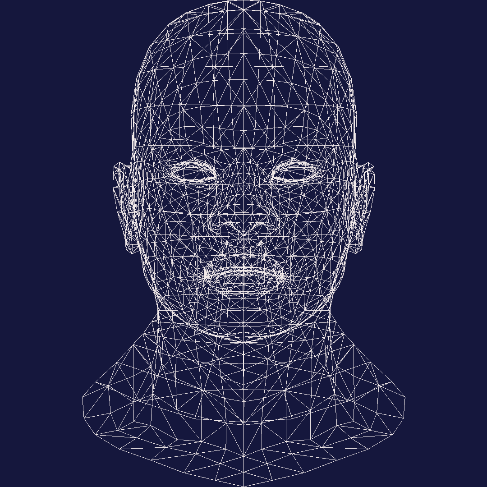
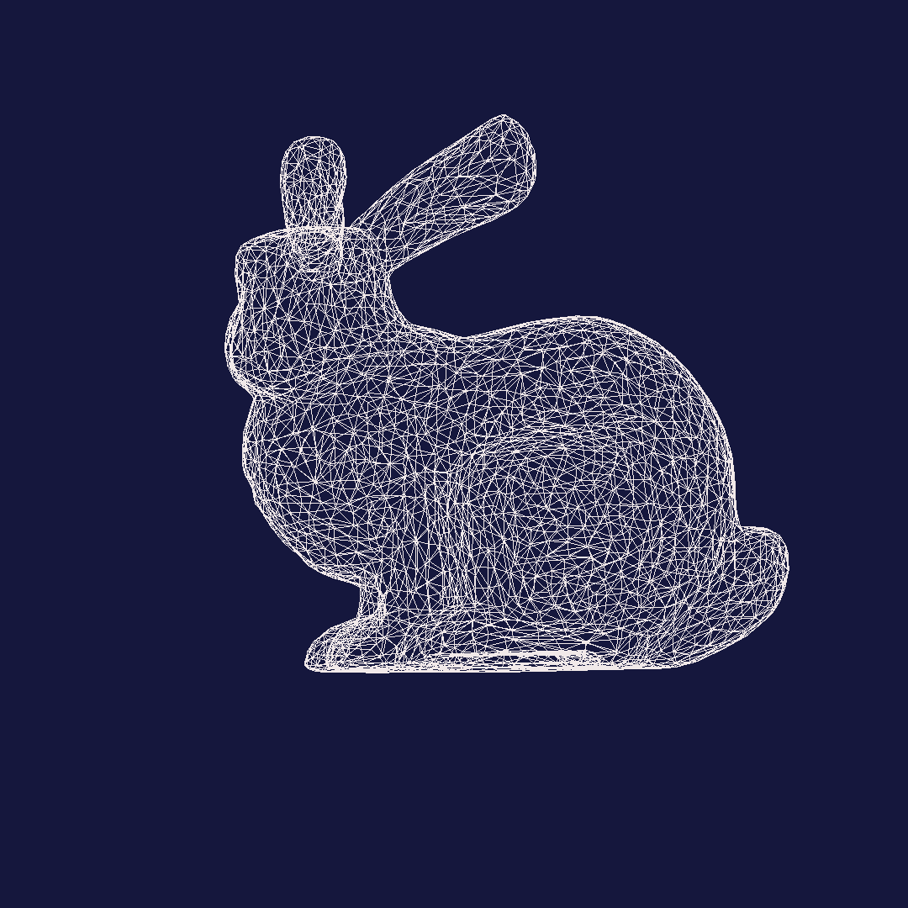
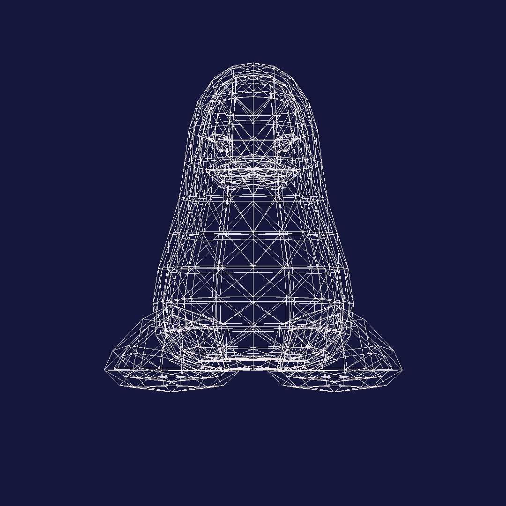
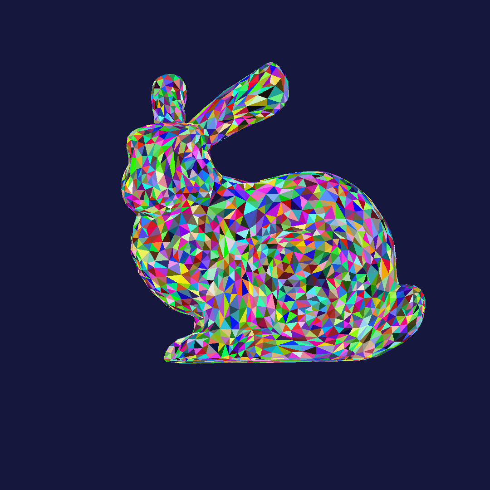
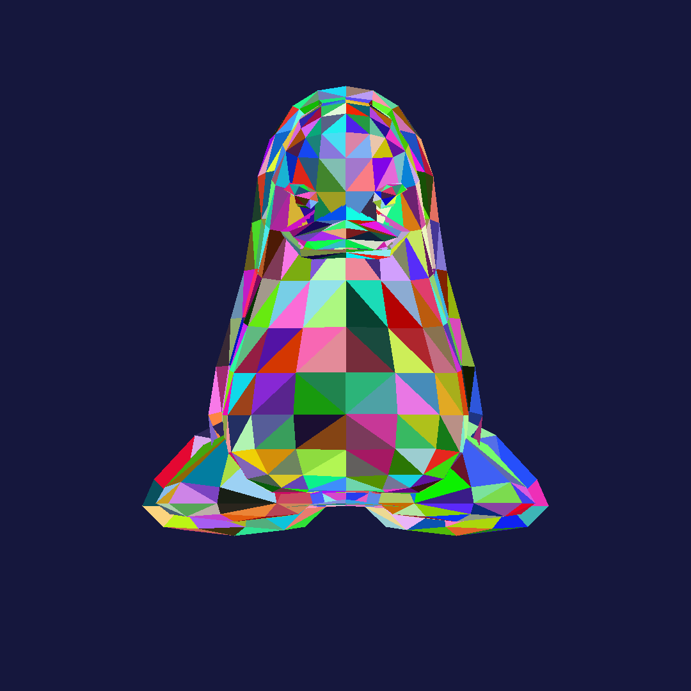
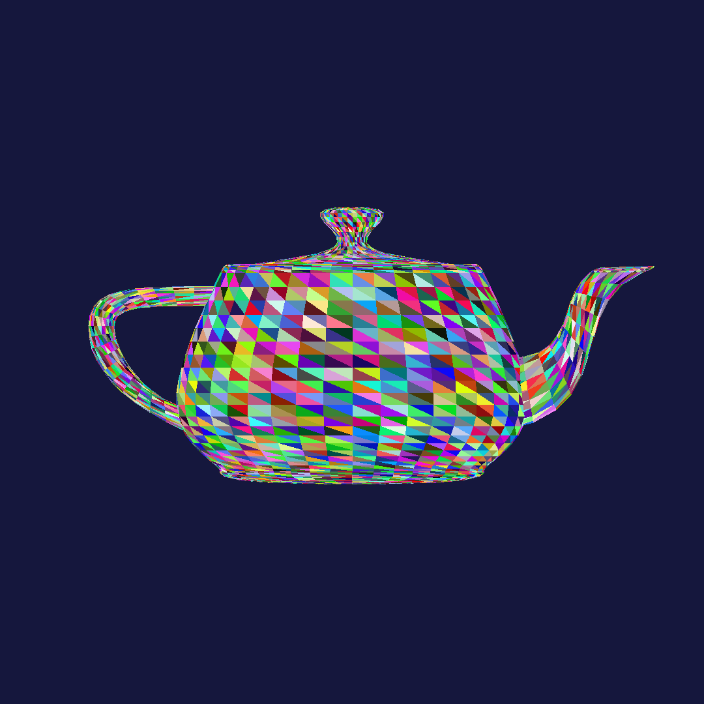

# Lunaris — CPU Software Rasterizer

Lunaris is a CPU-based software rasterizer written in C++ from scratch, without relying on any graphics API such as DirectX, OpenGL, or Vulkan.

The purpose of this project is to explore and implement the fundamental principles of the graphics pipeline entirely in software.

This renderer demonstrates how modern GPUs work internally by reproducing their core functionality on the CPU.

---

## Screenshots

### Wireframe

### Rasterization

                       

---

## Features

This project is currently a work in progress.

- Bresenham's Line Drawing algorithm
- No external graphics API
- CPU-based rendering
- OBJ model loading
- Rasterization
- Backface culling

---

## Acknowledgements

This project was inspired by the following resources:

- https://haqr.eu/tinyrenderer
- https://youtu.be/qjWkNZ0SXfo
- https://github.com/tsoding/formula
- Fundamentals of Computer Graphics, 4th Edition
- https://youtu.be/k5wtuKWmV48?si=P_Gl9xOSfxl6Rap3

---

## 3D Models Used

- https://github.com/Max-Kawula/penger-obj
- https://graphics.stanford.edu/courses/cs148-10-summer/as3/code/as3/teapot.obj
- https://graphics.stanford.edu/~mdfisher/Data/Meshes/bunny.obj

