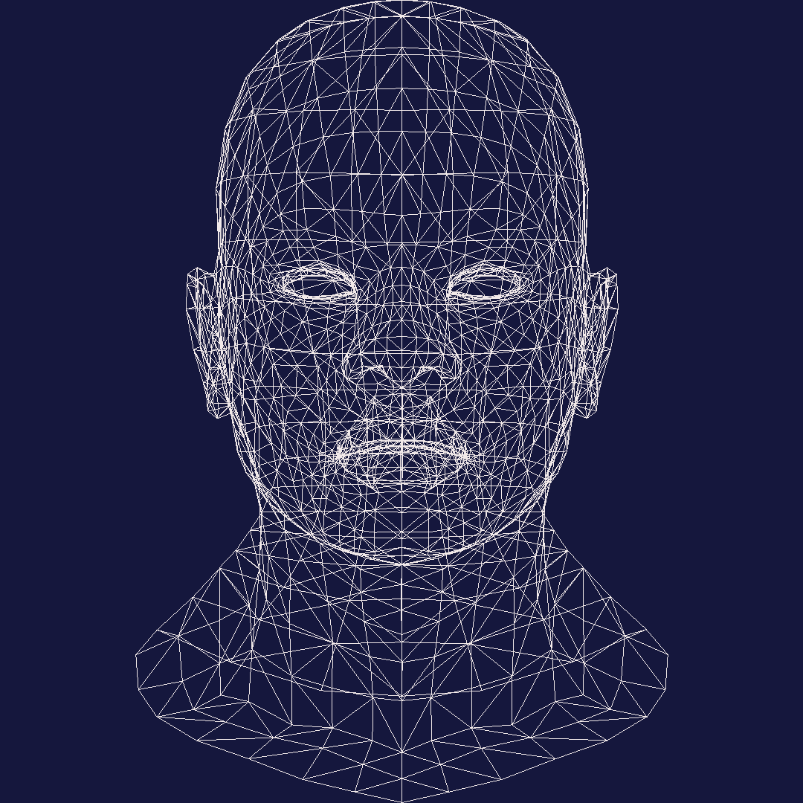
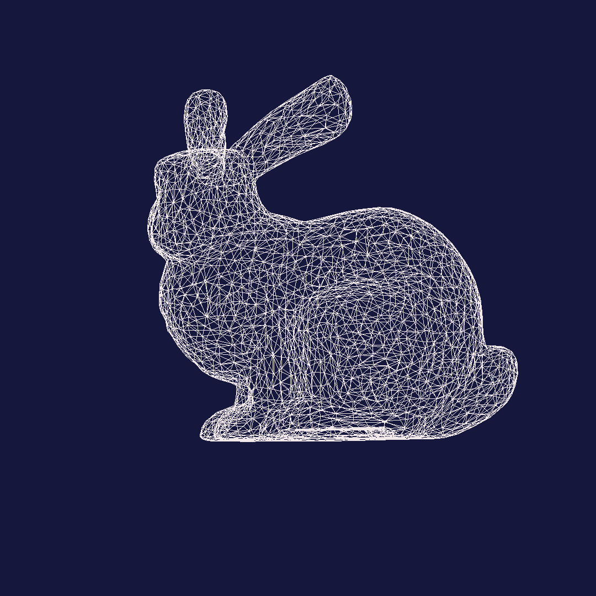
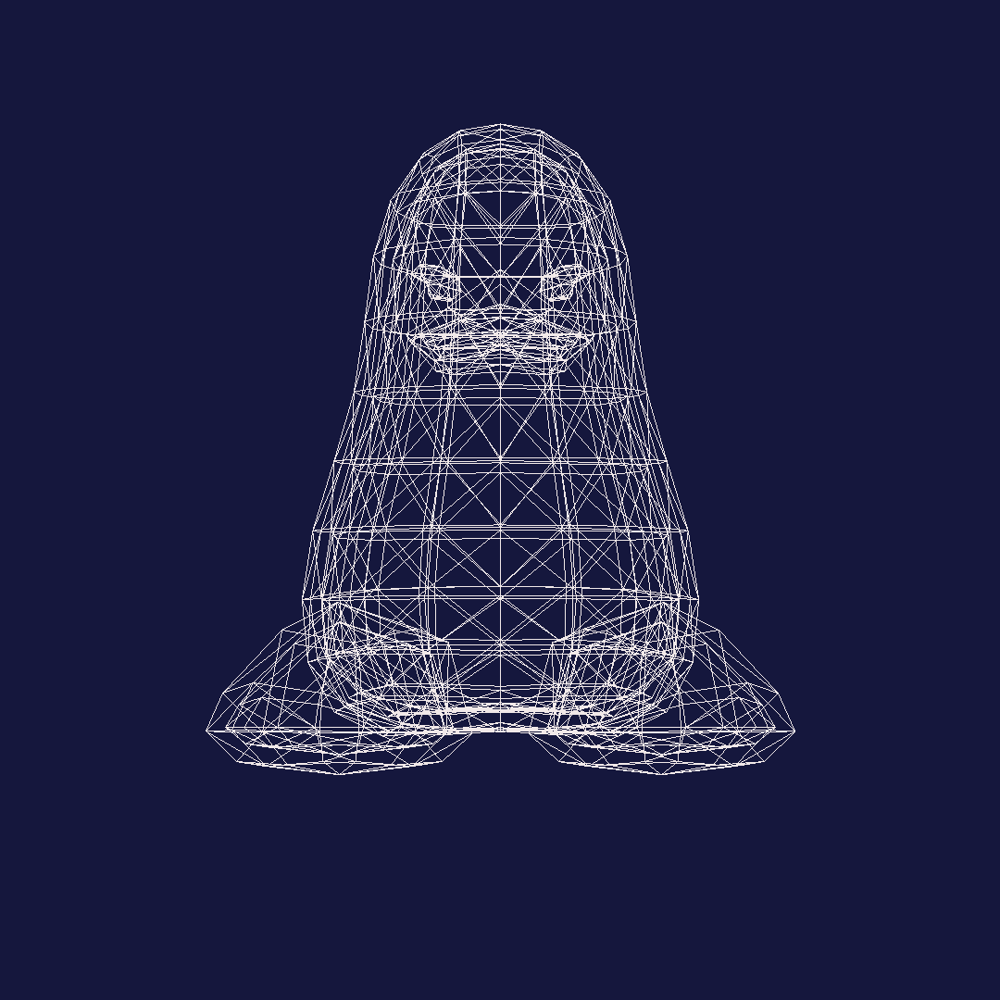
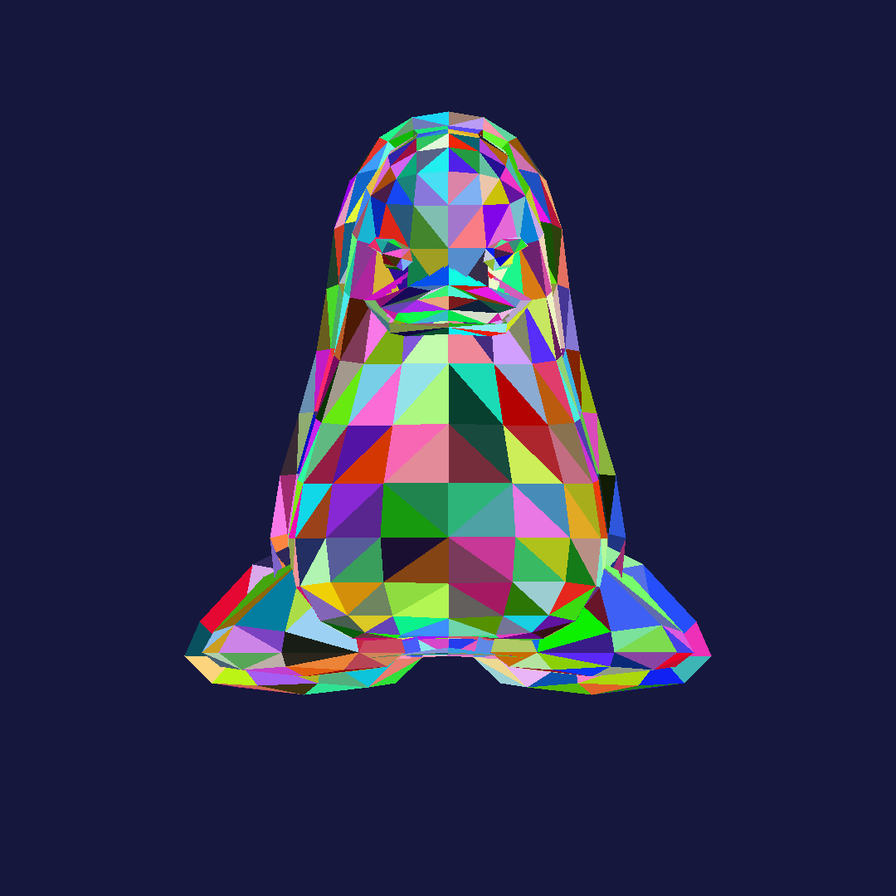
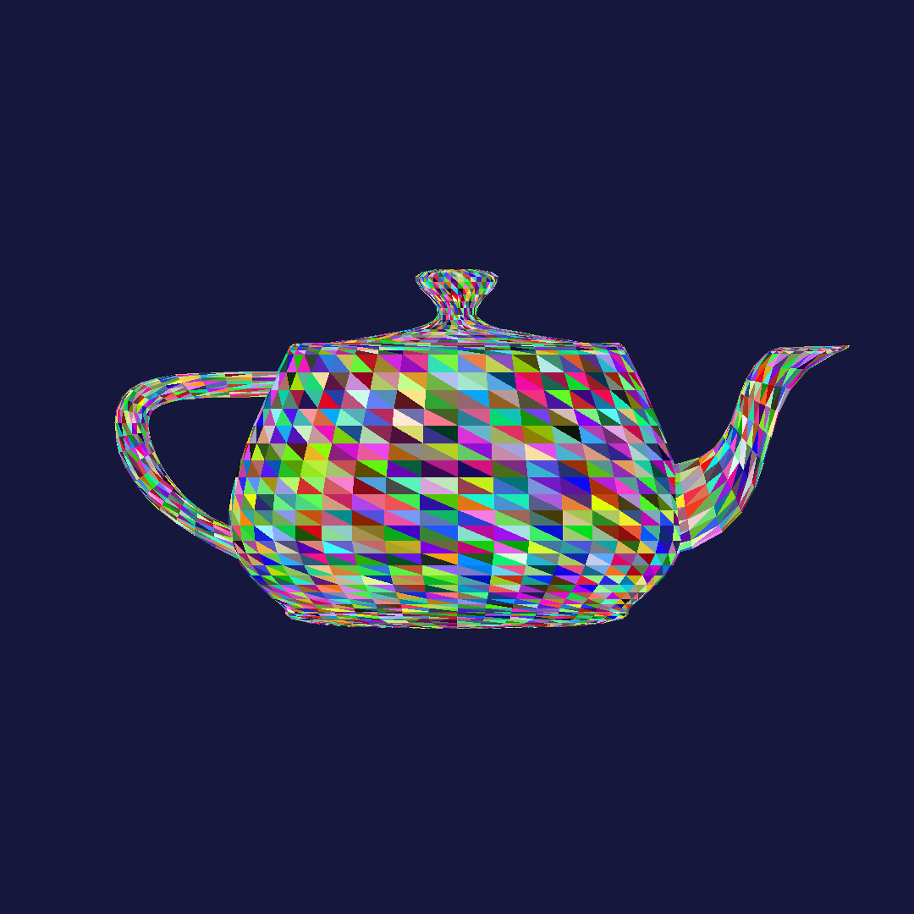

# Lunaris — CPU Software Rasterizer

Lunaris is a CPU-based software rasterizer written in C++ from scratch, without relying on any graphics API such as DirectX, OpenGL, or Vulkan.

Lunaris is designed to render and visualize 3D models entirely on the CPU, effectively “capturing” and displaying their rasterized output without relying on GPU APIs.

In other words, the project acts as a software-based camera and renderer for 3D objects.

---

## Screenshots

### Wireframe








### Rasterization


                       






---

## Features

This project is currently a work in progress.

- Bresenham's Line Drawing Algorithm
- Fully CPU-based rendering pipeline
- No external graphics API
- OBJ model loading
- Triangle rasterization
- Backface culling
- Custom math library

---

## Project Structure

```text
Lunaris/
├── Lunaris/              # Core rendering engine
│   ├── src/
│   └── include/
│
├── LunarisViewer/              # Win32 example app
│   └── main.cpp
│
└── build.bat
```

## Overview

### Lunaris
Contains the core software rasterizer, including the rendering pipeline, math library, and low-level drawing logic.

### LunarisViewer_Win32
A minimal Win32 application used to load, render, and display 3D models using the engine.

### build.bat
Simple build script for compiling the project.

---

## Matrix Math & Coordinate System

The core transformation and rendering pipeline is built on the following principles:

### Row-Major Layout:
The Matrix4D structure is stored in memory using a row-major layout, consistent with standard C/C++ array ordering. Matrix–vector multiplication (mul_vec4) is performed accordingly, where each row of the matrix is dotted with the vector components.
(Note: Developers familiar with APIs such as OpenGL, which use column-major conventions, should take care when working with matrix layout and multiplication order.)

---

## Acknowledgements

This project was inspired by:

- https://haqr.eu/tinyrenderer

---

## 3D Models Used

- https://github.com/Max-Kawula/penger-obj
- https://graphics.stanford.edu/courses/cs148-10-summer/as3/code/as3/teapot.obj
- https://graphics.stanford.edu/~mdfisher/Data/Meshes/bunny.obj

